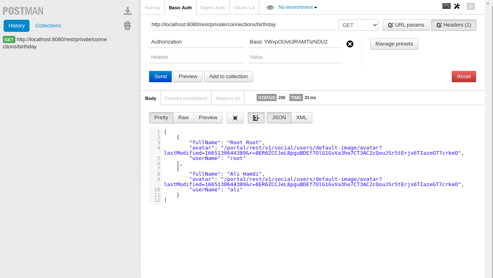
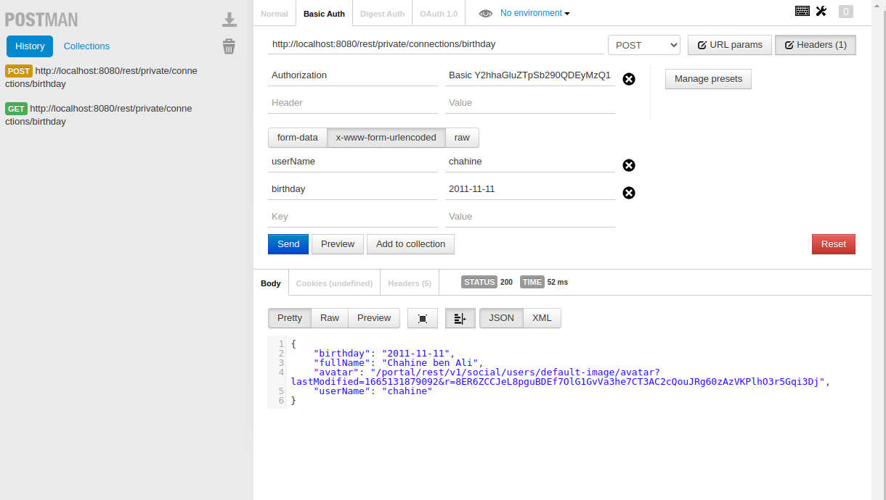
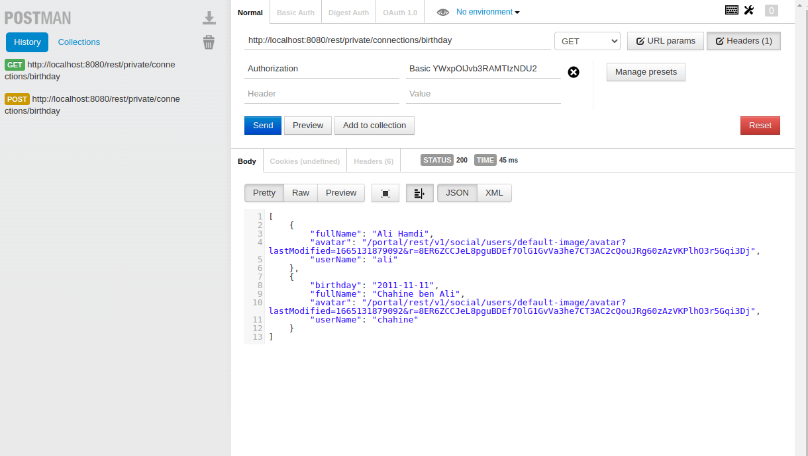

# Create a new REST service

This page will describe how to create a new REST Service exposing data and how to deploy it in eXo platform.
eXo platform contains an implementation of the Jax-RS ([JSR 311](https://jcp.org/aboutJava/communityprocess/final/jsr311/index.html)) which is the standard Java API for developing applications using the REST architecture.

## Develop a Rest service
You will implement a new REST service that will return the list of users who are connected to the current user, with their birthday dates.
This tutorial will be based on the same extension we created in [Prepare your extension project tutorial](../prepare-extension-project)
1.  Copy the extension to the sources folder **$EXO_HOME/sources** and rename it to **my-connections-birthdays-extension** as described in [Rename your extension](../prepare-extension-project.md#rename-the-extension) tutorial
    ::: tip
    **$EXO_HOME** is the environment variable that contain the path to the working directory as requested in [Start eXo community](/guide/getting-started/start-community#start-exo-platform) page   
    :::  
3.  Create a new Java package *org.exoplatform.samples.birthday* under **my-connections-birthdays-extension/services/src/main/java**
4.  Create a new Java class **MyConnectionsBirthdaysService** under **my-connections-birthdays-extension/services/src/main/java/org/exoplatform/samples/birthday** . This class will represent the RESTfull service. A RESFTful web service in eXo platform : 
    1.  Should implement the class interface *org.exoplatform.services.rest.resource.ResourceContainer*
    2.  Is compliant with JAX-RS specification which means it uses all available annotation to define the access URL path, the HTTP verbs (@Get , @POST, @DELETE, etc...)
    3.  Following is the source code for our RESTful service that will load the list of people connected with the current user with some of their profile properties 
    ```java
        package org.exoplatform.samples.birthday;

        import org.exoplatform.commons.utils.ListAccess;
        import org.exoplatform.services.log.ExoLogger;
        import org.exoplatform.services.log.Log;
        import org.exoplatform.services.rest.resource.ResourceContainer;
        import org.exoplatform.social.core.identity.model.Identity;
        import org.exoplatform.social.core.manager.IdentityManager;
        import org.exoplatform.social.core.manager.RelationshipManager;
        import org.json.JSONArray;
        import org.json.JSONObject;

        import javax.annotation.security.RolesAllowed;
        import javax.ws.rs.*;
        import javax.ws.rs.core.Context;
        import javax.ws.rs.core.Response;
        import javax.ws.rs.core.SecurityContext;
        import java.time.format.DateTimeFormatter;
        import java.util.Locale;

        @Path("connections/birthday") //Access path to our REST service
        public class MyConnectionsBirthdayRESTService implements ResourceContainer {
            // Logger for our class
            private static final Log LOG = ExoLogger.getLogger(MyConnectionsBirthdayRESTService.class);

            // Service used to load user identities
            private IdentityManager identityManager;

            //  Service used to manage relationships with other users
            private RelationshipManager relationshipManager;

            private static String BIRTHDAY_PROPERTY = "birthday";

            public MyConnectionsBirthdayRESTService(IdentityManager identityManager, RelationshipManager relationshipManager) {
                this.identityManager = identityManager;
                this.relationshipManager = relationshipManager;
            }

            @GET
            @RolesAllowed("users")
            public Response getMyConnectionsBirthday(@Context SecurityContext securityContext) {
                
                // Load current authenticated user
                String authenticatedUserName = securityContext.getUserPrincipal().getName();
                try {
                // Load the identity of the current user
                Identity authenticatedUser = identityManager.getOrCreateUserIdentity(authenticatedUserName);
                // Load list of people connected with him
                ListAccess<Identity> connections = relationshipManager.getConnections(authenticatedUser);
                Identity[] connectionsIdentities = connections.load(0, connections.getSize());
                
                // Create a JSON array that will be returned with the response
                JSONArray jsonArray = new JSONArray();
                for (Identity connection : connectionsIdentities) {
                    JSONObject connectionJSON = new JSONObject();
                    connectionJSON.put("userName", connection.getRemoteId());
                    connectionJSON.put("fullName", connection.getProfile().getFullName());
                    connectionJSON.put("avatar", connection.getProfile().getAvatarUrl());
                    connectionJSON.put(BIRTHDAY_PROPERTY, connection.getProfile().getProperty(BIRTHDAY_PROPERTY));
                    jsonArray.put(connectionJSON);
                }
                
                // If everything is OK, we return a HTTP 200 response with the Json array
                return Response.ok(jsonArray.toString()).build();
                } catch (Exception e) {
                // Something went wrong, an error is logged and a HTTP 500 error is returned
                LOG.error("Error getting user connections for {}", authenticatedUserName, e);
                return Response.serverError().build();
                }
            }
        }
    ```
5.  Add the configuration of the RESTFul web service to activate it under **webapp/src/main/webapp/WEB-INF/conf/configuration.xml**
    ```xml
        <?xml version="1.0" encoding="UTF-8"?>
        <configuration xmlns:xsi="http://www.w3.org/2001/XMLSchema-instance"
        xsi:schemaLocation="http://www.exoplatform.org/xml/ns/kernel_1_2.xsd http://www.exoplatform.org/xml/ns/kernel_1_2.xsd"
        xmlns="http://www.exoplatform.org/xml/ns/kernel_1_2.xsd">
            <!-- register new event listener that will be fired when a user updates his profile-->
            <component>
                <key>org.exoplatform.samples.birthday.MyConnectionsBirthdayRESTService</key>
                <type>org.exoplatform.samples.birthday.MyConnectionsBirthdayRESTService</type>
            </component>
        </configuration>
    ```
6.  Build & deploy the extension in your eXo platform server :
    ```shell
    > cd $EXO_HOME/sources/my-connections-birthdays-extension
    > mvn clean install
    > cp services/target/my-connections-birthday-services.jar $EXO_HOME/lib 
    > cp webapp/target/my-connections-birthday-webapp.war $EXO_HOME/webapps
    ```
7.  Add the built files **my-connections-birthday-services.jar** and **my-connections-birthday-webapp.war** to the volumes section of the eXo platform container :
    ```
        volumes:
         - exo_data:/srv/exo
         - exo_logs:/var/log/exo
         - $EXO_HOME/webapps/my-connections-birthday-webapp.war:/opt/exo/webapps/my-connections-birthday-webapp.war
         - $EXO_HOME/lib/my-connections-birthday-services.jar:/opt/exo/lib/my-connections-birthday-services.jar
    ```
8.  Start eXo platform containers using docker-compose :
    ```shell
    > docker-compose -f $EXO_HOME/docker-compose.yml up
    ```

9.  When the server is started, go to [http://localhost](http://localhost), login with an administrator account (*root* for example) and create some users. Then login with those users to get them connected with each others.
10. Using a HTTP client (for example [Postman](https://www.postman.com/)) :
    1.  In the URL put : [http://localhost/rest/private/connections/birthday](http://localhost/rest/private/connections/birthday)
    2.  Use Basic authentication mode, then put the username/password of one of your users
    3.  You should get a JSON response like in the following image :
                
11. As you noticed, there is no birthday date for those connections, thus you will need to provide how they can add it to their profiles. You will add a new function to the **MyConnectionsBirthdayRESTService.java** RESTful service that will update users profile with a birthday date. Add the following function to the Restful service :
   ```java
        // We added POST verb since this function will update data on the server
        @POST
        @RolesAllowed("users")
        public Response updateBirthday(@Context SecurityContext securityContext, @FormParam("birthday") String birthday,@FormParam("userName") String userName) {
            String authenticatedUserName = securityContext.getUserPrincipal().getName();
            if(!authenticatedUserName.equalsIgnoreCase(userName)) {
            // Only the user himself is able to update his birthday date
            LOG.error("{} could not update the birthday of {}", authenticatedUserName, userName);
            return Response.status(Response.Status.FORBIDDEN).build();
            }
            try {
            // Do a parsing to the received date and throw an exception if it is not valid
            LocalDate.parse(birthday, PARSER);
            // get the user identity and upda te the profile
            Identity authenticatedUser = identityManager.getOrCreateUserIdentity(authenticatedUserName);
            Profile authenticatedUserProfile = authenticatedUser.getProfile();
            // set the received birthday in the user profile
            authenticatedUserProfile.setProperty(BIRTHDAY_PROPERTY, birthday);
            identityManager.updateProfile(authenticatedUserProfile);
            // Prepare a response with the updated profile of the user
            JSONObject jsonObject = new JSONObject();
            jsonObject.put("userName", authenticatedUser.getRemoteId());
            jsonObject.put("fullName", authenticatedUserProfile.getFullName());
            jsonObject.put("avatar", authenticatedUserProfile.getAvatarUrl());
            jsonObject.put(BIRTHDAY_PROPERTY, authenticatedUserProfile.getProperty(BIRTHDAY_PROPERTY));
            return Response.ok(jsonObject.toString()).build();
            } catch (DateTimeParseException ex) {
            LOG.error("Could not parse date {}", birthday, ex);
            return Response.serverError().build();
            } catch (Exception e) {
            LOG.error("Could not update profile of user {}", authenticatedUserName, e);
            return Response.serverError().build();
            }
        } 
   ```         
12. Rebuild then redeploy the new jar & war in the eXo platform server : 
```shell
    > cd $EXO_HOME/sources/my-connections-birthdays-extension
    > mvn clean install
    > cp services/target/my-connections-birthday-services.jar $EXO_HOME/lib 
    > cp webapp/target/my-connections-birthday-webapp.war $EXO_HOME/webapps
```
1.  Start eXo platform containers using docker-compose :
    ```shell
       > docker-compose -f $EXO_HOME/docker-compose.yml up
    ```
1.  Using a HTTP client (for example [Postman](https://www.postman.com/)) :
    1.  In the URL put : [http://localhost/rest/private/connections/birthday](http://localhost/rest/private/connections/birthday)
    2.  Use the verb *POST* instead of *GET*
    3.  Use Basic authentication mode, then put the username/password of one of your users
    4.  Fill the form parameters indicating the userName and the birthday of the logged-in user
    5.  You should get a JSON response like in the following image :
          
    6.  When calling again the endpoint to get the list of connections, we can see that the birthday of the user was updated
           
## Create a frontend applications
Let's build an application that will consume both REST endpoints above.
1.  Update the extension and add files needed to build a new portlet as detailed in [Develop a front end application](./front-end-application.md)
    1.  Add the file portlet.xml (XML descriptor of the Portlet) under *webapp/src/main/webapp/WEB-INF/*
        ```xml
        <portlet-app version="2.0" xmlns="http://java.sun.com/xml/ns/portlet/portlet-app_2_0.xsd"
             xmlns:xsi="http://www.w3.org/2001/XMLSchema-instance"
             xsi:schemaLocation="http://java.sun.com/xml/ns/portlet/portlet-app_2_0.xsd http://java.sun.com/xml/ns/portlet/portlet-app_2_0.xsd">

            <!-- block to define a new portlet-->
            <portlet>
                <!-- Portlet name -->
                <portlet-name>birthdayApplication</portlet-name>
                <!-- Portlet class -->
                <portlet-class>org.exoplatform.commons.api.portlet.GenericDispatchedViewPortlet</portlet-class>
                <!-- Parameters needed to initiate the portlet. In this case the path to the HTML file of the VueJS application -->
                <init-param>
                <name>portlet-view-dispatched-file-path</name>
                <value>/index.html</value>
                </init-param>
                <!-- supported mimetypes -->
                <supports>
                <mime-type>text/html</mime-type>
                </supports>
                <!-- resource bundles for the application to ensure translation of all labels -->
                <resource-bundle>locale.portlet.birthdayApp</resource-bundle>
                <!-- Extra information for the portlet -->
                <portlet-info>
                <title>List of Birthday of my connections</title>
                </portlet-info>
            </portlet>
        </portlet-app>
        ```
    2.  Add the file *gatein-resources.xml* (XML descriptor for CSS/JS files) under *webapp/src/main/webapp/WEB-INF/*    
        ```xml
           <gatein-resources xmlns:xsi="http://www.w3.org/2001/XMLSchema-instance"
                  xsi:schemaLocation="http://www.exoplatform.org/xml/ns/gatein_resources_1_4
           http://www.exoplatform.org/xml/ns/gatein_resources_1_4"
                  xmlns="http://www.exoplatform.org/xml/ns/gatein_resources_1_4">
          <!-- This block will add a new CSS file that will be loaded in the page
          along with a related portlet (it won't be available for other pages) -->
          <portlet-skin>
            <!-- application name : the display name of the war in web.xml file -->
            <application-name>my-connections-birthday-webapp</application-name>
            <!-- portlet name defined in portlet.xml file -->
            <portlet-name>birthdayApplication</portlet-name>
            <!-- Skin name : default to Enterprise-->
            <skin-name>Enterprise</skin-name>
            <!-- Path to CSS file under this webapp-->
            <css-path>/css/birthdayApp.css</css-path>
          </portlet-skin>

          <!-- This block will add a new JS to the site. This CSS will be loaded in the page
          along with a related portlet (it won't be available for other pages) -->
          <portlet>
            <!-- portlet name defined in portlet.xml file -->
            <name>birthdayApplication</name>
            <!-- JS file will be added as a Javascript module -->
            <module>
              <script>
                <!-- JS is already minified by NPM, no need to minify it again -->
                <minify>false</minify>
                <!-- Path to JS file under this webapp-->
                <path>/js/birthdayApp.bundle.js</path>
              </script>
              <!-- Javascript dependencies for this JS module -->
              <depends>
                <module>vue</module>
              </depends>
              <depends>
                <module>eXoVueI18n</module>
              </depends>
            </module>
          </portlet>
        </gatein-resources>
        ```
    3.  Make sure the file *web.xml* (XML descriptor of Java servlets and filters) contains the declaration of the **ResourceRequestFilter**
        ```xml
          <!-- This web filter will load and serve static CSS/JS files according to the declaration in the gatein-resources.xml file -->
          <filter>
            <filter-name>ResourceRequestFilter</filter-name>
            <filter-class>org.exoplatform.portal.application.ResourceRequestFilter</filter-class>
          </filter>

          <filter-mapping>
            <filter-name>ResourceRequestFilter</filter-name>
            <url-pattern>/*</url-pattern>
          </filter-mapping>
        ```
    4.  Under **webapp** We need to add the files for NPM to build our new JS module :
        1.  ```.eslintrc.json``` 
            ```json
               {
                "extends": [
                    "eslint-config-meedsio"
                ],
                "rules": {
                    "vue/multi-word-component-names": "off",
                    "no-prototype-builtins": ["warn"],
                    "vue/no-mutating-props": ["warn"]
                },
                "globals": {
                }
                }
            ```  
        3.  ```webpack.prod.js``` 
            ```js
                const path = require('path');
                const ESLintPlugin = require('eslint-webpack-plugin');
                const { VueLoaderPlugin } = require('vue-loader')

                // the display name of the war
                const app = 'my-connections-birthday-webapp';

                const config = {
                mode: 'production',
                context: path.resolve(__dirname, '.'),
                module: {
                    rules: [
                    {
                        test: /\.js$/,
                        exclude: /node_modules/,
                        use: [
                        'babel-loader',
                        ]
                    },
                    {
                        test: /\.vue$/,
                        use: [
                        'vue-loader',
                        ]
                    }
                    ]
                },
                plugins: [
                    new ESLintPlugin({
                    files: [
                        './src/main/webapp/vue-app/*.js',
                        './src/main/webapp/vue-app/*.vue',
                        './src/main/webapp/vue-app/**/*.js',
                        './src/main/webapp/vue-app/**/*.vue',
                    ],
                    }),
                    new VueLoaderPlugin()
                ],
                entry: {
                    birthdayApp: './src/main/webapp/vue-app/main.js'
                },
                output: {
                    path: path.join(__dirname, `target/${app}/`),
                    filename: 'js/[name].bundle.js',
                    libraryTarget: 'amd'
                },
                externals: {
                    vue: 'Vue',
                    vuetify: 'Vuetify',
                    jquery: '$',
                },
                };

                module.exports = config;

            ```      
        5.  ```webpack.watch.js``` 
            ```js
                const path = require('path');
                const {merge} = require('webpack-merge');
                const webpackProductionConfig = require('./webpack.prod.js');

                // the display name of the war
                const app = 'my-connections-birthday-webapp';

                // add the server path to your server location path
                const exoServerPath = "/mnt/work/exo/binaries/snapshots/plf-enterprise-tomcat-standalone-6.4.x-20221008";

                let config = merge(webpackProductionConfig, {
                    mode: "development",
                output: {
                    path: path.resolve(`${exoServerPath}/webapps/${app}/`)
                },
                devtool: 'inline-source-map'
                });

                module.exports = config;

            ```  
        7.  ```package.json```      
            ```json
               {
                    "name": "birthdayApp",
                    "version": "1.0.0",
                    "description": "eXo portlet for displaying connections with their birthdays",
                    "repository": {
                        "type": "git",
                        "url": "https://github.com/exo-samples/docs-samples"
                    },
                    "scripts": {
                        "watch": "webpack --config webpack.watch.js --progress --color --watch",
                        "lint": "eslint --fix \"./src/main/webapp/vue-app/**\"",
                        "eslint-check": "eslint  \"./src/main/webapp/vue-app/**\"",
                        "build": "webpack --config webpack.prod.js --mode production"
                    },
                    "author": "eXo",
                    "license": "LGPL",
                    "devDependencies": {
                        "babel-loader": "^8.2.4",
                        "eslint": "^8.12.0",
                        "eslint-config-meedsio": "^1.0.4",
                        "eslint-plugin-vue": "^8.6.0",
                        "eslint-webpack-plugin": "^3.1.1",
                        "vue": "^2.6.14",
                        "vue-loader": "^15.9.8",
                        "vue-template-compiler": "^2.6.14",
                        "webpack": "^5.72.0",
                        "webpack-cli": "^4.9.2",
                        "webpack-merge": "^5.8.0"
                    }
                }

            ```  
      5.  You add the file *index.html* under **webapp/src/main/webapp** . This fiile contains the DOM element where tha application will be mounted 
          ```html
             <div id="birthdayApp"></div>
          ```  
      6. You add the file *birthdayApp.css* under **webapp/src/main/webapp/css** , you can customize the CSS of the application using it
         ```css
             #birthdayAppMain {
              display: flex;
              background: white;
              flex-direction: column;
              align-items: center;
              margin: auto;
              padding: 0 0 20px 0;
              margin-bottom: 20px;
            }

            #birthday-list {
              min-width: 300px;
            }

            #birthday-list input {
              width: 80%;
            }

            .birthday-app-title {
              font-size: 1.25rem !important;
              font-weight: 500;
              line-height: 2rem;
              letter-spacing: 0.0125em !important;
              color: #5f708a;
            }
         ```     
      8.  Create the application folder *vue-app* under **webapp/src/main/webapp/**. Inside it, add the files of the VueJS application :
          1.  ```main.js``` : the entry point for the application
              ```js
                import './initComponents.js'; // initialize other VueJS components
                import app from './components/birthdayAppMain.vue'; // import the main VueJS application

                // Get the user language
                const lang = eXo && eXo.env && eXo.env.portal && eXo.env.portal.language || 'en';

                // Get the name of the resource bundle
                const resourceBundleName = 'locale.portlet.birthdayApp';

                // Get the URL to load the resource bundles
                const url = `${eXo.env.portal.context}/${eXo.env.portal.rest}/i18n/bundle/${resourceBundleName}-${lang}.json`;

                // getting the resource bundles
                exoi18n.loadLanguageAsync(lang, url)
                  .then(i18n => {
                    // init Vue app when locale resources are ready
                    new Vue({
                      render: h => h(app),
                      i18n
                    }).$mount('#birthdayApp'); // mount the application on the HTML element with id = 'vue_webpack_sample'
                  });
              ```  
          2.  ```initComponents.js``` : JS file used to import all the VueJS components we are about to create
              ```js
                import birthdayAppMain from './components/birthdayAppMain.vue';
                import birthdayConnectionsList from './components/connectionsList.vue';

                const components = {
                  'birthday-main': birthdayAppMain,
                  'birthday-connections-list': birthdayConnectionsList,
                };
                for (const key in components) {
                  Vue.component(key, components[key]);
                }

              ```  
          3.  ```components/birthdayAppMain.vue``` : Main component for our application
              ```js
                <template>
                  <div id="birthdayAppMain">
                    <span class="birthday-app-title">{{ $t('birthdayApp.i18n.label') }}</span>
                    <birthday-connections-list birthday-items="" />
                  </div>
                </template>
              ```
          4.  ```components/connectionsList.vue``` : this is the component that will
              1.   Provide a date input so the user can add his birthday, then a call to the REST endpoint we already created in the first part of this tutorial will update the information in the server
              2.   Provide a list of connections with their birthday dates using a call to the REST endpoint
              ```js
                <template>
                  <div id="birthday-list">
                    <span class="alert-error">{{ this.errorMessage }}</span>
                    <span class="alert-success">{{ this.successMessage }}</span>
                    <input
                      type="date"
                      class="birthday-date"
                      v-model="birthdayDate"
                      @keyup.enter="saveBirthday">
                    <button @click="saveBirthday" type="button">{{ $t('birthdayApp.i18n.OK') }}</button>
                    <ul>
                      <li v-for="(item, index) in birthdayItems" :key="index">
                        <div v-if="item.birthday">
                          <a :href="userProfileURL(item.userName)">
                            
                            <span :id="'item-' + index">{{ item.fullName }}</span>
                          </a>
                          <span :id="'item-' + index">{{ item.birthday }}</span>
                        </div>
                      </li>
                    </ul>
                  </div>
                </template>
                <script>
                export default {
                  data: () => ({
                    birthdayItems: [],
                    successMessage: '',
                    errorMessage: ''
                  }),
                  created() {
                    return fetch(`${eXo.env.portal.context}/${eXo.env.portal.rest}/connections/birthday`, {
                      method: 'GET',
                      credentials: 'include',
                    }).then(resp => {
                      if (!resp || !resp.ok) {
                        throw new Error('Response code indicates a server error', resp);
                      } else {
                        return resp.json();
                      }
                    }).then(data => {
                      this.birthdayItems = data;
                    });
                  },
                  methods: {
                    saveBirthday() {
                      return fetch(`${eXo.env.portal.context}/${eXo.env.portal.rest}/connections/birthday`, {
                        method: 'POST',
                        credentials: 'include',
                        body: `birthday=${this.birthdayDate}&userName=${eXo.env.portal.userName}`,
                        headers: {
                          'Content-Type': 'application/x-www-form-urlencoded'
                        }
                      }).then(resp => {
                        if (!resp || !resp.ok) {
                          this.errorMessage = 'An error happened when updating birthday';
                          setTimeout(() => (this.errorMessage = ''), 5000);
                          throw new Error('Response code indicates a server error', resp);
                        } else {
                          return resp.json();
                        }
                      }).then(() => {
                        this.successMessage = 'Birthday updated successfully!';
                        setTimeout(() => (this.successMessage = ''), 5000);
                      });
                    },
                    userProfileURL(userName) {
                      return userName && `/portal/dw/profile/${userName}` || '#';
                    }
                  }
                };

                </script>
              ```
      9.  All the files are here, you can build and deploy the updated war file
          ```shell
             > mvn clean package
             > cp webapp/target/my-connections-birthday-webapp.war $EXO_HOME/webapps
             > docker-compose -f docker-compose.yml up
          ```        
      10. Here is a video showing how to add the application in a page and how it should look like
          <video width="640" height="480" controls>
            <source src="/vids/create-rest-service/add-birthday-app-to-new-page.mp4" type="video/mp4">
          </video>

   
